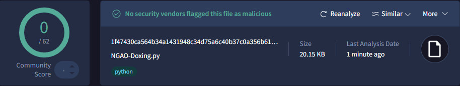
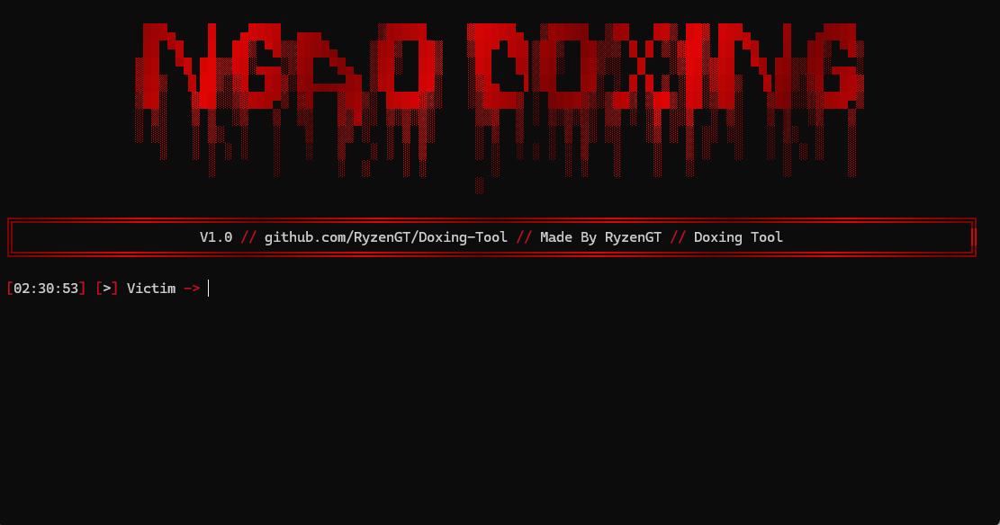

<h1 align="center">NGAO-Doxing / By RyzenGT 
</h1>

## 🔧 Instructions:
- Install [Python](https://www.python.org/ftp/python/3.13.3/python-3.13.3-amd64.exe) and add to PATH.
- [Download](https://github.com/RyzenGT/NGAO-Nuker/releases/latest) the `.zip` file and place all the files in a single folder.
- Make sure `NGAO-Doxing.py` and `Dox-Created` are grouped together.
- Double-click `NGAO-Doxing.py`.
- The tool is ready to launch, **enjoy!**

> **Dox Builder developed by RyzenGT — powerful, fast, and beautiful**\
> *Send me a DM if there's any problem :* `kng.sgao`

## 📸 Menu Picture:

  

 

## ⚠️ Disclaimer:

- Please do not resell, distribute or modify without my written consent.
- Do not use it for malicious purposes
- This is for educational purposes only.